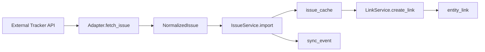

# Blueprint - tracker-bridge

## 0. 優先実施順序（最優先参照）

**`docs/kv-priority-roadmap/` の内容を最優先で参照すること。**

### プライオリティ順序

1. `kv-cache-independence-amendments.md` (P1)
2. `01-typed-ref-unification.md` (P2)
3. `02-workx-state-history-and-bundle-audit.md` (P3)
4. `03-workx-memx-context-rebuild-resolver.md` (P4)
5. `04-tracker-bridge-minimum-integration.md` (P5)

### 重要な制約

- **実施順を崩さないこと**: P1 → P2 → P3 → P4 → P5 の順で進める
- **typed_ref統一前に各PJを並行で深く進めるのは危険**: 参照形式が統一されていない状態での並行作業は、repo間の不整合を引き起こす

---

## 1. Problem Statement

外部トラッカー（Jira / GitHub Issues / Backlog / Linear など）と内部システム（agent-taskstate / memx-core）の間で、
チケット情報の同期・対応付けを行いたい。現在は外部トラッカーと内部作業状態の乖離が発生しており、
手動での紐付けや進捗共有にコストがかかっている。

## 2. Scope

### In:
- 外部トラッカーとの接続定義管理
- 外部 issue / ticket の取得とローカルキャッシュ保存
- 外部 issue と内部 task (agent-taskstate.task) の対応付け
- 同期イベントの記録と監査
- 最小限の inbound / outbound 同期

### Out:
- agent-taskstate の task state 自体の管理
- memx-core の evidence / knowledge の保存
- エージェント本体の推論やオーケストレーション
- 外部トラッカーの完全ミラーリング
- 全コメント・全履歴・全添付ファイルの完全再現

## 3. Constraints / Assumptions

- **言語**: Python 3.11以上
- **DB**: SQLite 3.39以上（JSON1関数使用可能）
- **認証情報**: DBに保存せず、環境変数またはsecret store参照
- **疎結合**: agent-taskstate / memx-core とは typed_ref による論理参照のみ
- **MVP優先**: 複雑な双方向同期よりも、責務分離と追跡可能性を優先

## 4. I/O Contract

### Input:
- 外部トラッカーAPIからの issue データ（JSON）
- 内部からの link 作成リクエスト（local_ref, remote_ref）
- 同期指示（connection_id, issue_key）

### Output:
- issue_cache レコード（SQLite）
- entity_link レコード（SQLite）
- sync_event レコード（SQLite）
- 外部トラッカーへの status/comment 反映（outbound）

## 5. Minimal Flow



## 6. Interfaces

### CLI (予定):
- `tracker-bridge connection create --type jira --name "My Jira" --base-url https://...`
- `tracker-bridge issue import --connection <id> --key PROJ-123`
- `tracker-bridge link create --local agent-taskstate:task:abc --remote tracker:jira:PROJ-123`
- `tracker-bridge sync status [--pending|--failed]`

### Python API:
```python
from tracker_bridge.db import connect
from tracker_bridge.repositories.connection import TrackerConnectionRepository
from tracker_bridge.services.connection_service import ConnectionService

conn = connect("tracker.db")
repo = TrackerConnectionRepository(conn)
svc = ConnectionService(repo)
connection = svc.create_connection(
    tracker_type="jira",
    name="My Jira",
    base_url="https://example.atlassian.net",
    project_key="PROJ",
)
```