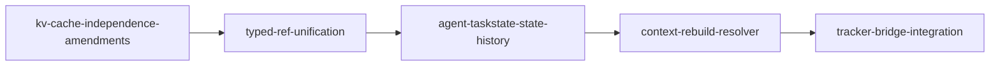

# Orchestration - tracker-bridge

## 現在のフェーズ

**Phase 0: typed_ref 統一 (P1-P2)**

現段階は `docs/kv-priority-roadmap/01-typed-ref-unification.md` の実施中。

### 依存関係

### ブロッカー

現在のブロッカーなし。

## フェーズ詳細

### Phase 1: 基盤整備 (P1-P2)

- kv-cache-independence-amendments の要件確認
- typed_ref 4セグメント形式への統一
- 3 repo の parser/formatter/validator 統一

### Phase 2: 状態管理 (P3)

- agent-taskstate state history の実装
- bundle audit 機能の実装

### Phase 3: コンテキスト再構築 (P4)

- context rebuild resolver の実装
- memx-core との連携

### Phase 4: 統合 (P5)

- tracker-bridge minimum integration
- E2Eテストの整備

## タスクステータス

| Task ID | Source | Status | Owner |
|---------|--------|--------|-------|
| P1-001 | kv-cache-independence-amendments | planned | - |
| P2-001 | typed-ref-unification | planned | - |
| P3-001 | agent-taskstate-state-history | planned | - |
| P4-001 | context-rebuild-resolver | planned | - |
| P5-001 | tracker-bridge-integration | planned | - |